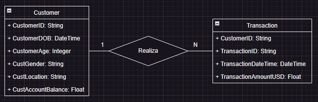

# Paso 1: Alcance del proyecto y captura de datos.

* Identificar y recopilar los datos que usaras para tu proyecto. 
El [DataSet](https://www.kaggle.com/datasets/shivamb/bank-customer-segmentation) seleccionado es **Bank Customer Segmentation** contiene datos demográficos y de transacciones de clientes de un banco indio, este dataset tiene información como: 
- Fecha de nacimiento
- Género
- Ubicación
- Saldo de la cuenta
- Fecha de Transacción 
- Tiempo de transacción 
- Monto en INR

* Explicar para qué casos de uso final deseas preparar los datos, por ejemplo: tabla de análisis, aplicación de fondo, base de datos de fuentes de verdad, etc. 
El caso de uso para el que prepararé los datos es para realizar **Análisis de comportamiento de gastos según la edad y género de los clientes**, el objetivo de este caso de uso será encontrar información valiosa sobre los patrones de gastos de diferentes grupos demográficos, esto nos puede ayudar a tomar decisiones estratégicas que podemos relacionar con la oferta de productos y servicios para los clientes.

# Paso 2: Explorar y evaluar los datos, el EDA.

En el notebook llamado "Paso2.ipynb" realizado en google colab se llevaron a cabo los siguientes pasos:

1. Importe las librerías necesarias.
2. Cargue los datos del dataset. 
3. Verifique la estructura del dataset, explore los tipos de datos con los que contamos.
4. Realice algunos cambios en el tipo de datos y cree algunas nuevas columnas calculadas.
5. Realice la eliminación de valores nulos del dataset.
6. Valide datos atípicos por cada una de las columnas.
7. Luego realice limpieza de los datos, eliminando por ejemplo edades que no tengan sentido, acotando los datos en edades entre 13 y 110 años, además de algunas otras limpiezas que se podrán validar en el notebook.
8. Finalmente elimine las columnas no necesarias y exporte el dataset resultante como un archivo csv.

Todos los pasos anteriores los fui explicando en el notebook mencionado.

# Paso 3: Definir el modelo de datos

1. Trazar el modelo de datos conceptual y explicar por qué se eligió ese modelo.

	
	 
	Se eligió este modelo conceptual porque tiene una estructura clara y comprensible definiendo las entidades principales, que en este caso son el Cliente y la transacción, adicionalmente nos facilita la comprensión respecto a las relaciones entre las entidades y como se pueden consultar y analizar.  
	
2. Diseñar la arquitectura y los recursos utilizados.
	
3. Indique claramente los motivos de la elección de las herramientas y tecnologías para el proyecto.

4. Proponga con qué frecuencia deben actualizarse los datos y por qué.
	La frecuencia de actualización de los datos depende de la disponibilidad y la actualización de los mismos, en este caso como estamos hablando de transacciones realizadas por los clientes de un banco lo más recomendable sería tener una actualización lo más cercano al tiempo real, es decir, en intervalos de pocos minutos o hasta segundos, pero en este caso como el objetivo del proyecto es el **Análisis de comportamiento de gastos según la edad y género de los clientes** no es primordial contar con la actualización de manera frecuente, en un principio se podrían realizar análisis con una muestra de los datos y posterior a ello cuando ya se tenga un análisis completamente estructurado, se pueden realizar actualizaciones periódicas.

# Paso 5: Completar la redacción del proyecto

1. ¿Cuál es el objetivo del proyecto? 
	El objetivo de este proyecto es encontrar información valiosa sobre los patrones de gastos de diferentes grupos demográficos, a partir de un dataset que alberga la información acerca de las transacciones realizadas por clientes de un banco indio.
2. ¿Qué preguntas quieres hacer?
	- ¿Hay alguna relación entre la ubicación geográfica de los clientes y sus patrones de gastos?
	- ¿Existe alguna diferencia significativa en los patrones de gastos entre hombres y mujeres?
	- ¿Hay alguna correlación entre el saldo de la cuenta de los clientes y sus patrones de gastos según su edad y género?
	- ¿Cuáles son las transacciones de mayor valor en términos de gastos y quiénes son los clientes que las realizaron?
	- ¿Cuáles son los grupos de edad que realizan los gastos más altos?
	- ¿Cuál es la distribución de gastos según la edad y el género de los clientes?
3.  ¿Por qué eligió el modelo que eligió? 
	Tal como indiqué anteriormente la elección de este modelo se debe a que nos permite varias cosas.
	- **Separar las preocupaciones** ya que cada entidad tiene sus propias relaciones y propiedades, esto facilita entender mejor la información al momento de analizar los datos.
	- Genera beneficios en cuanto a **simplicidad y claridad** ya que al tener dos entidades pequeñas ayuda a tener un modelo de datos un poco más simple.
	- Ayuda a no tener **redundancia de datos**, dado que si por ejemplo un cliente tiene varias transacciones no se va a repetir toda la información del cliente cada vez, se tendrá solo la información relevante de la transacción en este caso.
	- Permite **flexibilidad y escalabilidad** debido a que por ejemplo se podrían agregar entidades adicionales como productos o categorías de transacciones para analizar mejor que patrones de gastos tienen los clientes.
	- **Facilita el análisis de la información** de los clientes y las transacciones por separado.

4. Diferentes escenarios:
	- Si los datos se incrementaran en 100x 
	Primero que todo se tiene que contar con infraestructura escalable para poder manejar grandes volumenens de datos, luego tendría que validar que las consultar realizadas durante el proceso de ETL efectivamente sean lo más eficientes posibles, debería buscar la posibilidad de distribuir el procesamiento de los datos en paralelo. Adicionalmente se tendría que validar si toda la información es necesaria para el analisis o no para realizar filtrados de información. 
	
	- Si las tuberías se ejecutaran diariamente en una ventana de tiempo especifica. 
	Se debe iniciar por la priorización de tareas, es decir, si tenemos tareas de extracción que pueden llevar mucho más tiempo se debe empezar con estas en la ventana de tiempo asignada, por ello debemos considerar y medir el tiempo necesario para las etapas de extracción, transformación y carga, tambien se debe pensar en la paralelización de tareas, si es posible ejecutar transformaciónes al mismo tiempo sin que afecten los resultados finales, lo mejor es realizarlo y por ultimo se debe contar con un mecanismo de monitorización, alertas y control de errores para siempre estar al tanto de como está llevandose todo a cabo.

	 

	- Si la base de datos necesitara ser accedido por más de 100 usuarios funcionales. 
	Abordar esta situación implica dimensionar adecuadamente la infraestructura, como ya lo he dicho en un punto anterior, se debe contar con infraestructura escalable, implementar medidas de seguridad y controles de acceso de forma que los usuarios que accedan si sean quienes deben hacerlo y que tengan acceso a la información que les compete, tambien se debe optimizar el rendimiento y establecer un monitoreo continuo. Además, es importante asegurarse de proporcionar formación y soporte adecuados para los usuarios.

	 

	- Si se requiere hacer analítica en tiempo real, ¿cuales componentes cambiaria a su arquitectura propuesta? 
